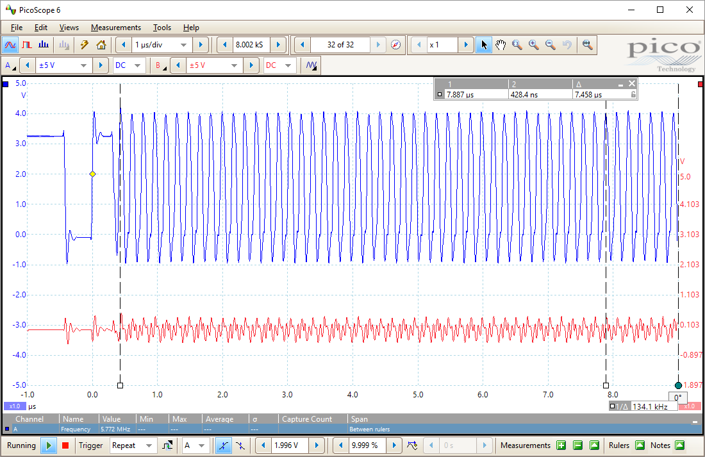
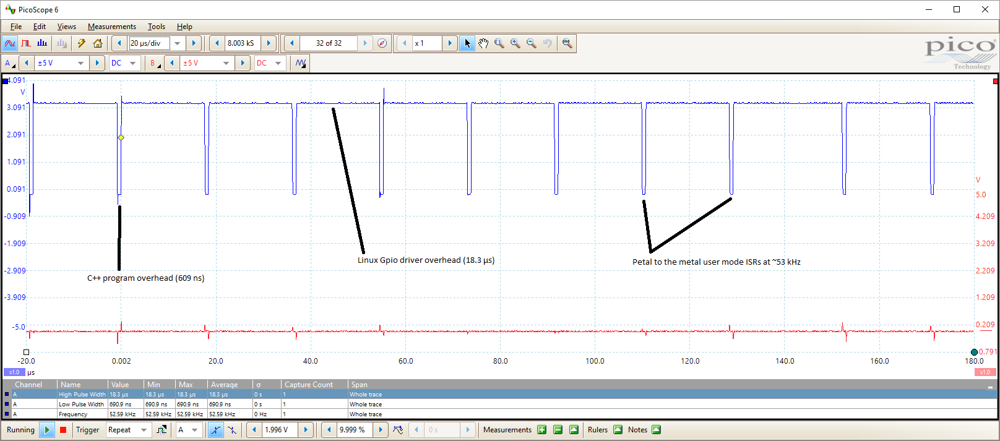
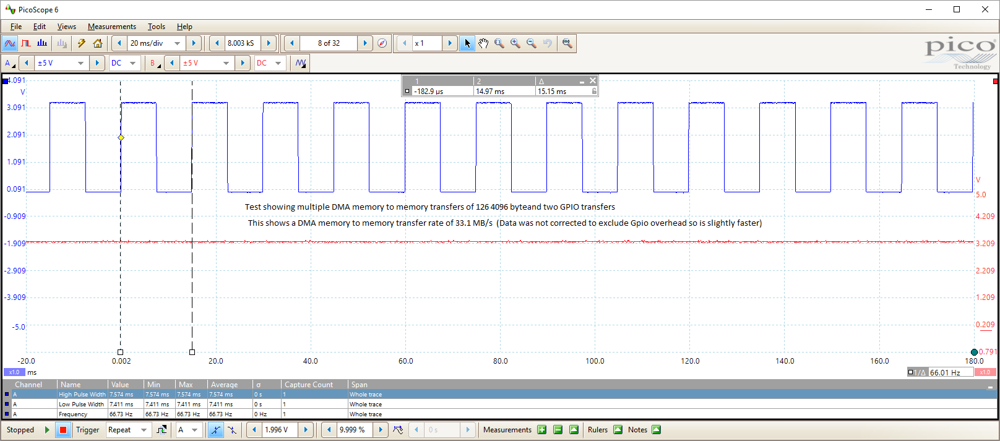
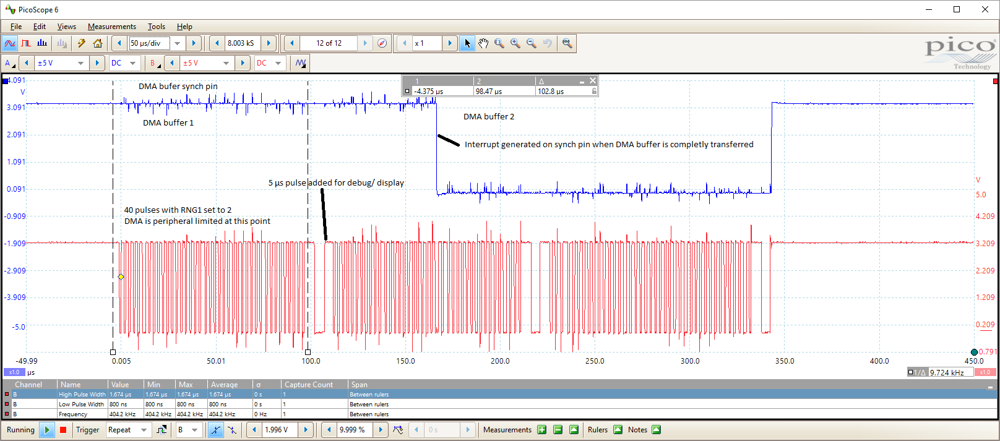
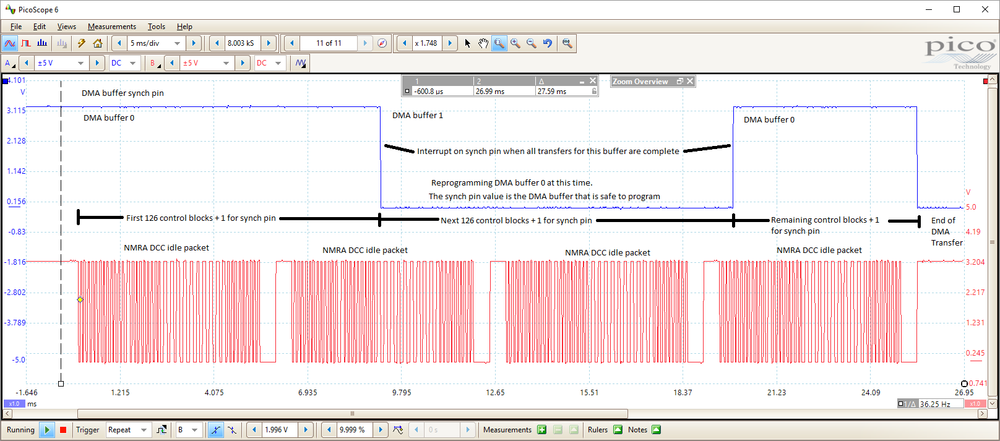
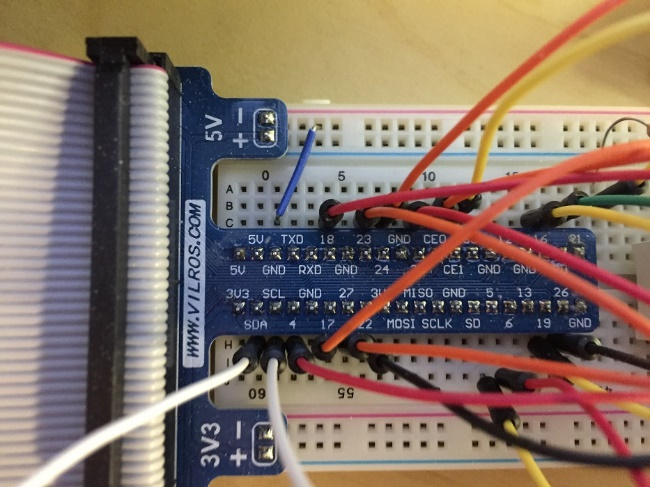

APLPIe
======

Another Peripheral Library for raspberry Pi.

APLPIe

This library is a set of C++ classes meant to be compiled into your application.
The base classes allow access to the raspberry pi peripherals and some basic
application support functionality like predefined init and uninit.

Many ideas and some code snippets taken from:

WiringPi: https ://projects.drogon.net/raspberry-pi/wiringpi/

Pigpio: http://abyz.me.uk/rpi/pigpio/

Raspberry-Pi-DMA-Example https://github.com/Wallacoloo/Raspberry-Pi-DMA-Example

Happy Coding!

General Features
----------------

### Gpio

The APLPIe library supports hi-speed direct user mode GPIO pin read and writes.
Currently the mode of access is via mapped memory which requires sudo level
access. Although, access can also be achieved via the linux gpio driver, other
peripherals in this library such as user mode Dma also require sudo access.

The following code illustrates the bit bang test displayed in the trace:

~~~~~~~~~~~~~~~~~~~~~~~~~~~~~~~~~~~~~~~~~~~~~~~~~~~~~~~~~~~~~~~~~~~~~~~~~~~~~~~~
// Bit bang test...
for (int i = 0; i < 100; i++)
{
    
    gpio.WritePin(DmaPin1, PinState::High);
    gpio.WritePin(DmaPin1, PinState::Low);
}
~~~~~~~~~~~~~~~~~~~~~~~~~~~~~~~~~~~~~~~~~~~~~~~~~~~~~~~~~~~~~~~~~~~~~~~~~~~~~~~~

### User mode interrupt processing

The APLPIe library has full support for the user mode interrupt processing
through the raspberry PI GPIO driver. Support for the void\* argument parameter
is included such that interrupt processing can be handled in an object oriented
fashion. A bare bones as fast as you can go test is provided that shows maximum
achievable speeds with Linux and a raspberry PI.

The following code illustrates the interrupt processing test:

~~~~~~~~~~~~~~~~~~~~~~~~~~~~~~~~~~~~~~~~~~~~~~~~~~~~~~~~~~~~~~~~~~~~~~~~~~~~~~~~
void IntTestIsr(void* arg)
{   
    interruptCount++;
    interruptActive = true; 
}

void Test::InterruptTest(Gpio& gpio)
{
    gpio.SetIsr(6,
        IntTrigger::Rising,
        IntTestIsr,
        (void*) NULL);
    uint32_t spinCount = 0;
    interruptActive = true;
    do
    {
        if (interruptActive)
        {
            gpio.WritePin(6, PinState::Low);
            for (int i = 0; i < 150; i++);
            interruptActive = false;
            gpio.WritePin(6, PinState::High);
        }
        else
        {
            spinCount++;
        }

    } while (interruptCount < 10000);

    DBG("interruptCount = %u, spinCount = %u",
        interruptCount,
        spinCount);
    gpio.ClearIsr(6);
}
~~~~~~~~~~~~~~~~~~~~~~~~~~~~~~~~~~~~~~~~~~~~~~~~~~~~~~~~~~~~~~~~~~~~~~~~~~~~~~~~

### Memory to memory DMA

APLPIe fully supports the Raspberry PI DMA peripheral. DMA support is achieved
via the standard peripheral device class. Since cache coherent memory is
required for proper DMA memory transfers APLPIe also provides C++ classes for
interacting with the Linux MailBox interface in a DMA specific way. To
characterize full speed memory to memory DMA transfers a test is provided that
maps 126 individual control blocks each of 1 page (4096 bytes) in length,
describing memory to memory DMA transfers with an incrementing byte pattern.
This allows for easy validation of the destination memory. The test uses 128 DMA
control blocks total which leaves two control blocks that are used for GPIO pin
toggling that are used to time the DMA transfer speed with a oscilloscope. The
GPIO pin toggle control blocks are at DMA control blocks indices 63 and 127.

### Pulse Generator

APLPIe provides a general purpose pulse generator that combines the
functionality of the Gpio, Pwm, and Dma peripherals to provided a double
buffered interrupt driven pulse generator that is gated by the timing of the Pwm
peripheral. This class can be used to output pulses of up to 400 kHz on any Gpio
pin(s) of the Raspberry PI Gpio peripheral. The 400 kHz limit is a limitation of
the Raspberry PI chip itself and the pulse train is peripheral (hardware)
limited at this point).

Scope trace showing the fastest possible pulse which is peripheral limited:

Another use case showing a serial stream of three national model railroad
association (NMRA) digital command control (DCC) idle packets.

APLPIe API
==========

GPIO
----

### void Gpio::Export(int pin);

Although this library uses the memory mapped peripheral address to write and
read the GPIO peripheral, exporting and Unexporting of the raspberry PI I/O pins
is still required in the user-land application. This suggests that the linux
GPIO kernel driver still has master control of the memory space and can override
and prevent the access of the GPIO memory addresses. To export a pin simply call
the export function with the number of the pin you would like to export. All
pins in the library are currently BCM only. (The ones printed on the circuit
board when looking at the breakout board.)

Raspberry PI breakout board. This library uses the BCM (white printing) pin
numbers

### void Gpio::Unexport(int pin)

When the user-land application is shutdown the GPIO pins should be restored to
their original un-exported state.

### void Gpio::SetPinMode(int pin, PinMode mode)

Once the GPIO pins have been exported they may be accessed by the memory mapped
base address. This function provides access to the pin mode register and allow
the following pin modes to be set:

~~~~~~~~~~~~~~~~~~~~~~~~~~~~~~~~~~~~~~~~~~~~~~~~~~~~~~~~~~~~~~~~~~~~~~~~~~~~~~~~
// GPIO Function Select bits

enum class PinMode

{

Input = 0b000,

Output = 0b001,

Alt0 = 0b100,

Alt1 = 0b101,

Alt2 = 0b110,

Alt3 = 0b111,

Alt4 = 0b011,

Alt5 = 0b010

};

uint32_t fSel = gpioToGPFSEL[pin];

uint32_t shift = gpioToShift[pin];

volatile uint32_t* address = &Base->GPFSEL[fSel];

*address |= ((uint32_t) mode << shift);
~~~~~~~~~~~~~~~~~~~~~~~~~~~~~~~~~~~~~~~~~~~~~~~~~~~~~~~~~~~~~~~~~~~~~~~~~~~~~~~~

### void Gpio::SetPudMode(int pin, PudMode mode)

If the pin is configured as an output you must additionally specify whether it
should be a pull-up or pull-down pin. The reader is referred to the BCM
peripheral manual for the Broadcom chip. Currently this function supports the
correct timing sequence specified in the manual. The following modes are
supported:

~~~~~~~~~~~~~~~~~~~~~~~~~~~~~~~~~~~~~~~~~~~~~~~~~~~~~~~~~~~~~~~~~~~~~~~~~~~~~~~~
enum class PudMode

{

Off = 0b00, // disable pull - up / down

PullDown = 0b01, // Enable Pull Down control

PullUp = 0b10, // Enable Pull Up control

Reserved = 0b11

};
~~~~~~~~~~~~~~~~~~~~~~~~~~~~~~~~~~~~~~~~~~~~~~~~~~~~~~~~~~~~~~~~~~~~~~~~~~~~~~~~

### bool SetIsr(int pin, IntTrigger::Enum mode, void(*function)(void*), void\* arg)

Each pin may be configured to generate an interrupt when it changes state.
Possible state changes include rising edge falling edge or both. A user function
pointer is provided and will be called when the interrupt occurs. An optional
argument may be provided and is usually set to the this point so that callbacks
may be made into the instance object that called the function.

### bool ClearIsr(int pin)

This function releases all resources allocated by the SetIsr function. Once the
resources are released the pin will no longer respond to interrupts until SetIsr
is called for the pin again. If the pin has not already been set up for
receiving interrupts the function simply returns.
